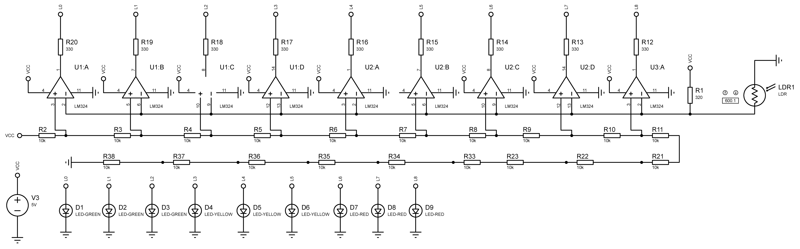
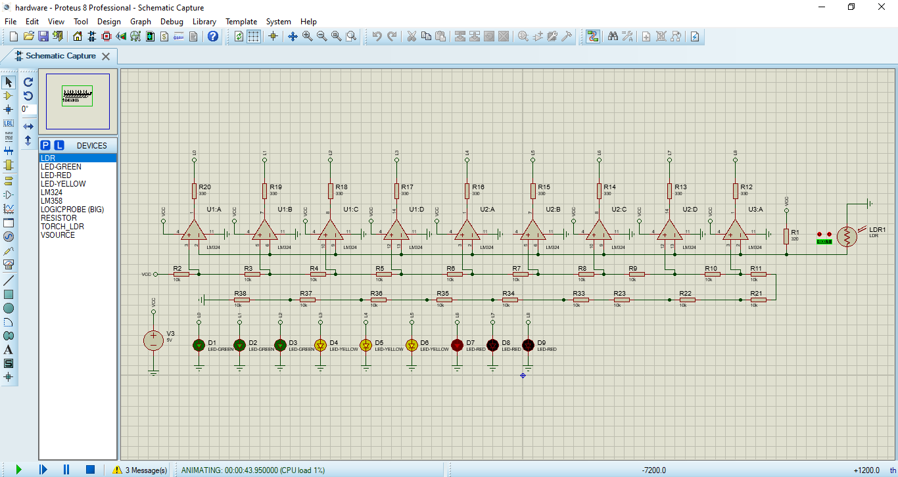

# Analog Light Intensity Meter

A light intensity meter without using microcontrollers. The main idea is to develop a circuit using only basics electronics components such as LDRs, LEDs, resistors and op-amps to create an ADC to read the voltage on the LDR. There's also 9 LEDs indicating the light intensity, where 9 LEDs on means a high luminosity and all LEDs off means a low luminosity.

## 💻 Project

#### Circuit



#### Prototype


## 🚀 Technologies

This project was developed with the following technologies:

 Proteus

 Basic Electronics

## 🏃 Usage

To use this project you can either [simulate it](#simulating) or [build it on a protoboard](#building).

### Simulating

- You must have [Proteus Professional](https://www.labcenter.com/downloads) installed on your computer
- Clone this repository with the following command:

```bash
git clone https://github.com/douglasJovenil/analog-light-intensity-meter
```

- Open `lightIntensityMeter.pdsprj` with **Proteus**
- Click the **Run the simulation** button



### Building

Just buy the components and follow [this guide](https://github.com/douglasJovenil/matEle#circuit) 😋
